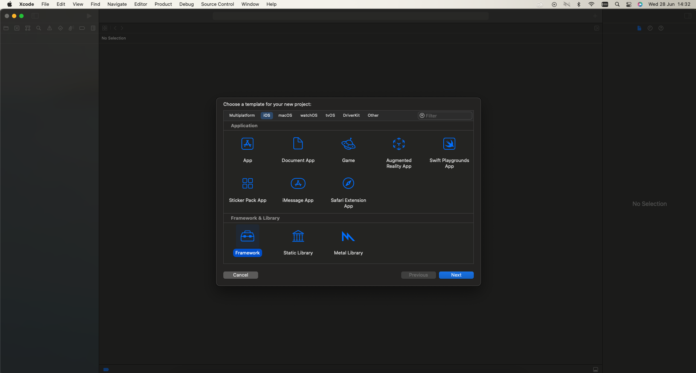
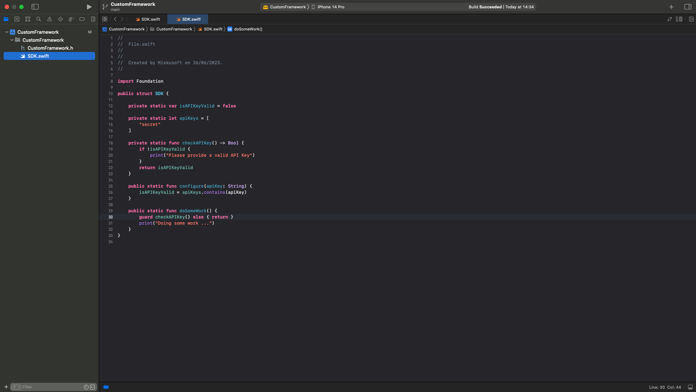
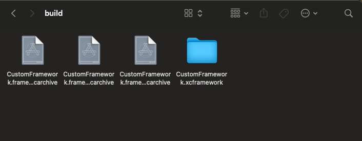

# CustomFramework

CustomFramework is working name.

## Create Framework proj
In Xcode 
1. Create new projet
2. Select Framework type

3. Add implementation

4. Run below commands in root directory of framework project (where is e.g. `CustomFramework.xcodeproj`)
5. Use output bundle `CustomFramework.xcframework` in Package Project Type as Source


## Archive commands
In terminal cd to the root folder of the Framework project

### Archive for iOS

```bash
xcodebuild archive \
-scheme CustomFramework \
-configuration Release \
-destination "generic/platform=iOS" \
-archivePath "./build/CustomFramework.framework-iphones.xcarchive" \
SKIP_INSTALL=NO \
BUILD_LIBRARY_FOR_DISTRIBUTION=YES
```

### Archive for Simulator

```bash
xcodebuild archive \
-scheme CustomFramework \
-configuration Release \
-destination "generic/platform=iOS Simulator" \
-archivePath "./build/CustomFramework.framework-iphonesimulator.xcarchive" \
SKIP_INSTALL=NO \
BUILD_LIBRARY_FOR_DISTRIBUTION=YES
```

### Archive for macOS

```bash
xcodebuild archive \
-scheme CustomFramework \
-configuration Release \
-destination "platform=macOS,arch=x86_64,variant=Mac Catalyst" \
-archivePath "./build/CustomFramework.framework-catalyst.xcarchive" \
SKIP_INSTALL=NO \
BUILD_LIBRARY_FOR_DISTRIBUTION=YES
```

### Create Framework

```bash
xcodebuild -create-xcframework \
-framework "./build/CustomFramework.framework-iphonesimulator.xcarchive/Products/Library/Frameworks/CustomFramework.framework" \
-framework "./build/CustomFramework.framework-iphones.xcarchive/Products/Library/Frameworks/CustomFramework.framework" \
-framework "./build/CustomFramework.framework-catalyst.xcarchive/Products/Library/Frameworks/CustomFramework.framework" \
-output "./build/CustomFramework.xcframework"
```

### All in one

```bash
xcodebuild archive \
-scheme CustomFramework \
-configuration Release \
-destination "generic/platform=iOS" \
-archivePath "./build/CustomFramework.framework-iphones.xcarchive" \
SKIP_INSTALL=NO \
BUILD_LIBRARY_FOR_DISTRIBUTION=YES
xcodebuild archive \
-scheme CustomFramework \
-configuration Release \
-destination "generic/platform=iOS Simulator" \
-archivePath "./build/CustomFramework.framework-iphonesimulator.xcarchive" \
SKIP_INSTALL=NO \
BUILD_LIBRARY_FOR_DISTRIBUTION=YES
xcodebuild archive \
-scheme CustomFramework \
-configuration Release \
-destination "platform=macOS,arch=x86_64,variant=Mac Catalyst" \
-archivePath "./build/CustomFramework.framework-catalyst.xcarchive" \
SKIP_INSTALL=NO \
BUILD_LIBRARY_FOR_DISTRIBUTION=YES
xcodebuild -create-xcframework \
-framework "./build/CustomFramework.framework-iphonesimulator.xcarchive/Products/Library/Frameworks/CustomFramework.framework" \
-framework "./build/CustomFramework.framework-iphones.xcarchive/Products/Library/Frameworks/CustomFramework.framework" \
-framework "./build/CustomFramework.framework-catalyst.xcarchive/Products/Library/Frameworks/CustomFramework.framework" \
-output "./build/CustomFramework.xcframework"
```